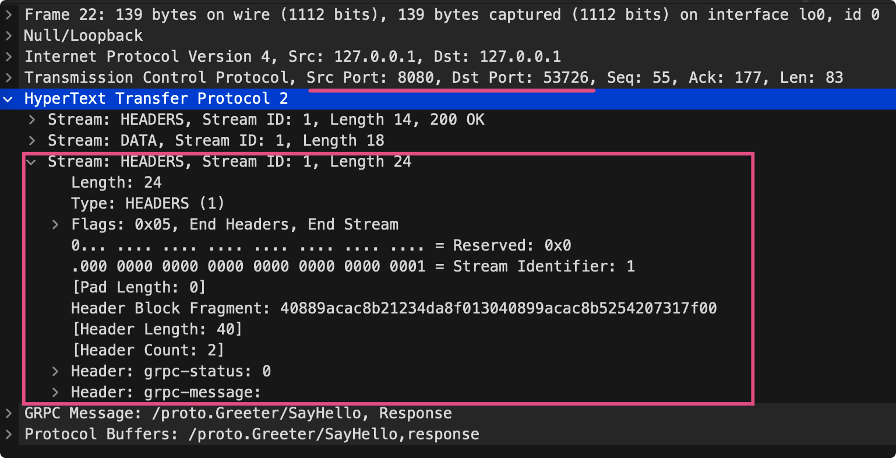

在使用gRpc的过程中，有一个想法：gRpc客户端、服务端是怎么交互的呢？

从这个想法萌生出一个验证方法，通过抓包来分析其交互过程与底层数据，一起来看看吧。


## gRpc是什么

gRpc是什么？

gRPC 是一个高性能、开源和通用的 RPC 框架，面向移动和 HTTP/2 设计。目前提供 C、Java 和 Go 语言版本，分别是：grpc, grpc-java, grpc-go. 其中 C 版本支持 C, C++, Node.js, Python, Ruby, Objective-C, PHP 和 C# 支持。

gRPC 基于 HTTP/2 标准设计，带来诸如双向流、流控、头部压缩、单 TCP 连接上的多复用请求等特。这些特性使得其在移动设备上表现更好，更省电和节省空间占用。

一句话概括：gRpc是Google基于HTTP/2、protobuf开源的一个RPC框架。


## 准备工作

正所谓：欲善其事必先利其器，所以在开始抓包之前需要做好如下准备。

- 抓包软件：wireshark
- 代码：gRpc代码
- 操作系统：Windows、Linux、Macos 其一


## wireshark安装

官网下载地址：https://www.wireshark.org/download.html


## gRpc示例代码

示例代码目录结构

```go
.
└── helloworld
    ├── client
    │   └── main.go
    ├── go.mod
    ├── go.sum
    ├── proto
    │   ├── helloworld.pb.go
    │   └── helloworld.proto
    └── server
        └── main.go
```

helloworld.proto

```protobuf
syntax = "proto3";

package proto;

// The greeting service definition.
service Greeter {
    // Sends a greeting
    rpc SayHello (HelloRequest) returns (HelloReply) {}
}

// The request message containing the user's name.
message HelloRequest {
    string name = 1;
    int32 age = 2;
}

// The response message containing the greetings
message HelloReply {
    string message = 1;
    string address = 2;
}
```

通过protoc对proto文件生成go代码

```shell
cd proto
protoc --go_out=plugins=grpc:. ./*
```

服务端代码 - server/main.go

```go
package main

import (
	"context"
	"log"
	"net"

	pb "github.com/ivansli/grpc_helloworld/proto"
	"google.golang.org/grpc"
)

const (
	port = ":8080"
)

// server is used to implement helloworld.GreeterServer.
type server struct {}

// SayHello implements helloworld.GreeterServer
func (s *server) SayHello(ctx context.Context, in *pb.HelloRequest) (*pb.HelloReply, error) {
	log.Printf("Received: %v", in.GetName())
	return &pb.HelloReply{Message: "Hello " + in.GetName()}, nil
}

func main() {
	lis, err := net.Listen("tcp", port)
	if err != nil {
		log.Fatalf("failed to listen: %v", err)
	}

	s := grpc.NewServer()
	pb.RegisterGreeterServer(s, &server{})

	log.Printf("server listening at %v", lis.Addr())
	if err := s.Serve(lis); err != nil {
		log.Fatalf("failed to serve: %v", err)
	}
}
```

客户端代码 - client/main.go

```go
package main

import (
	"context"
	"google.golang.org/grpc/metadata"
	"log"
	"os"
	"time"

	pb "github.com/ivansli/grpc_helloworld/proto"
	"google.golang.org/grpc"
)

const (
	address     = "localhost:8080"
	defaultName = "world"
)

func main() {
	// Set up a connection to the server.
	conn, err := grpc.Dial(address, grpc.WithInsecure())
	if err != nil {
		log.Fatalf("did not connect: %v", err)
	}
	defer conn.Close()
	c := pb.NewGreeterClient(conn)

	// Contact the server and print out its response.
	name := defaultName
	if len(os.Args) > 1 {
		name = os.Args[1]
	}
	ctx, cancel := context.WithTimeout(context.Background(), time.Second)
	defer cancel()

	ctx = metadata.AppendToOutgoingContext(ctx, "metadata", "is metadata")

	r, err := c.SayHello(ctx, &pb.HelloRequest{Name: name})
	if err != nil {
		log.Fatalf("could not greet: %v", err)
	}
	log.Printf("Greeting: %s", r.GetMessage())
}
```


## 步骤

① 运行服务端代码 server/main.go，监听在8080端口

```shell
go run server/main.go
```

② 打开wireshark，等待抓包

③ 运行客户端代码 client/main.go

```go
go run client/main.go
```


## wireshark抓包gRpc交互过程


通过抓包我们发现，客户端使用53726端口与监听在8080的服务端进行交互以及数据传递，其过程大概分为10个。

① 通过TCP三次握手建立整个通信链路

② Magic

③ SETTINGS

④ HEADERS

⑤ DATA

⑥ WINDOW_UPDATE, PING

⑦ PING（pong）

⑧ HEADERS, DATA

⑨ WINDOW_UPDATE, PING

⑩ PING（pong）

在抓包的过程中，发现在应用层出现若干不同Stream类型，分别有：Magic、SETTINGS、HEADERS、DATA、WINDOW_UPDATE、PING。


至于它们的作用，且看下面分析：

### Magic


Magic帧的主要作用是对使用HTTP/2双方协议的确认, 是一个链接前言。作用是确定启用HTTP/2连接。


### SETTINGS

SETTINGS的主要作用是设置这一个连接的参数，作用于是整个连接。从图中可以看到出现了多个SETTINGS，原因是在发送完连接前言后，客户端、服务端还需要进一步的确定一些信息。


客户端发送给服务端的SETTINGS：


服务端发送给客户端的SETTINGS：


### HEADERS

HEADERS的主要作用是存储和传递HTTP的头信息。

客户端发送给服务端的HEADERS：


可以看到很多重要的信息：

- method
- scheme
- path
- authority
- content-type
- user-agent 等

这些都是gRpc很重要的基础属性。

> 注意:
>
> 使用`google.golang.org/grpc/metadata`包`metadata`在客户端、服务端传递的数据，也在HEADERS中。


服务端发送给客户端的HEADERS：



服务端发送给客户端的HEADERS中有两个重要的字段：grpc-status、grpc-message是客户端调用的状态结果。


### DATA

DATA的主要作用是填充主体信息，是数据帧。


客户端发送给服务端的DATA：


其中，包含两个重要部分：

① GRPC Message

`/proto.Greeter/SayHello` 为proto中service定义的的方法，也是服务端对外提供的方法。

② Protocol Buffers

与protobuf有关，其中Field(1)为定义pb.HelloRequest结构的Name参数 `&pb.HelloRequest{Name: "world"}`。

> 同时可以发现，他们都带有request标识，说明这是客户端发起的请求。


服务端发送给客户端的DATA：


与客户端发送给服务端的DATA类似，但是有response标识，说明这是个服务端响应信息。

Field(1)为 `&pb.HelloReply{Message: "Hello world"}`的Message字段。


### WINDOW_UPDATE

WINDOW_UPDATE的主要作用是管理流控制窗口。


客户端发送给服务端的WINDOW_UPDATE：


服务端发送给客户端的WINDOW_UPDATE：


### PING

主要作用是用于判断当前连接是否依旧可用，相当于心跳。分为：

- 客户端ping服务端，服务端pong
- 服务端ping客户端，客户端pong


服务端发送给客户端的PING：


客户端回复给服务端的PONG：


注意：同一个Ping/Pong，有相同的标识字符串（图示中标识为：02041010090e0707）。

# 总结

至此，通过抓包分析gRpc的交互过程，以及各种不同类型帧的作用以及使用，进一步了解了gRpc。总结如下：

- gRpc在简历三次握手之后，客户端、服务端会发送连接前言（Magic+SETTINGS）以确立协议和配置
- gRpc在传输数据过程中会设计滑动窗口（WINDOW_UPDATE）等流控策略
- 在gRpc中附加信息是基于HEADERS帧进行传递的，具体的请求、响应数据存储在DATA帧中
- gRpc的请求、响应结果可分为HTTP和gRpc状态响应（grpc-status、grpc-message）两种类型
- 如果服务端发起PING，客户端会响应PONG，反之亦然


## 参考及扩展阅读

- [wireshark分析grpc协议 | zhanglonglong的个人博客，记录问题，关于计算机和软件 (gitee.io)](https://zhanglonglong12.gitee.io/posts/451572563/)

- [抓包gRPC的细节及分析 - 敬维 (jingwei.link)](https://jingwei.link/2018/10/02/grpc-wireshark-analysis.html)

- [使用wireshark对grpc的helloworld抓包分析_墨怀旧-CSDN博客_grpc 抓包](https://blog.csdn.net/heart66_A/article/details/111084954)


