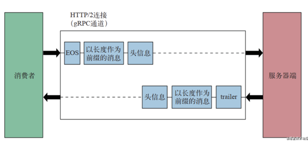
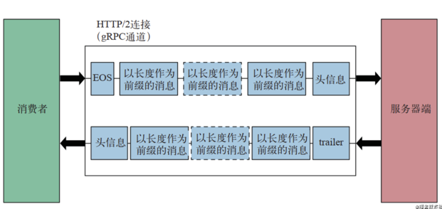

# Metadata example

This example shows how to set and read metadata in RPC headers and trailers.
Please see
[grpc-metadata.md](https://github.com/grpc/grpc-go/blob/master/Documentation/grpc-metadata.md)
for more information.

## Start the server

```
go run server/main.go
```

## Run the client

```
go run client/main.go
```

---


```go
// ServerStream defines the server-side behavior of a streaming RPC.
//
// All errors returned from ServerStream methods are compatible with the
// status package.
type ServerStream interface {
	// SetHeader sets the header metadata. It may be called multiple times.
	// When call multiple times, all the provided metadata will be merged.
	// All the metadata will be sent out when one of the following happens:
	//  - ServerStream.SendHeader() is called;
	//  - The first response is sent out;
	//  - An RPC status is sent out (error or success).
	// 
	// 通过header设置metadata数据
	// 调用多次则会被合并
	// 在3种情况之下会把metadata数据发送出去
	// 1. 调用 ServerStream.SendHeader()
	// 2. 第一个响应包已经发出
	// 3. 一个rpc状态已经发送出去
	SetHeader(metadata.MD) error
	
	// SendHeader sends the header metadata.
	// The provided md and headers set by SetHeader() will be sent.
	// It fails if called multiple times.
	// 
	// 通过 header 发送  metadata.
	SendHeader(metadata.MD) error
	
	// SetTrailer sets the trailer metadata which will be sent with the RPC status.
	// When called more than once, all the provided metadata will be merged.
	//
	// 多次调用，则被合并
	// 设置 trailer metadata 数据，在发送时会跟RPC状态一起发送
	SetTrailer(metadata.MD)
	
	// Context returns the context for this stream.
	Context() context.Context
	
	// SendMsg sends a message. On error, SendMsg aborts the stream and the
	// error is returned directly.
	//
	// SendMsg blocks until:
	//   - There is sufficient flow control to schedule m with the transport, or
	//   - The stream is done, or
	//   - The stream breaks.
	//
	// SendMsg does not wait until the message is received by the client. An
	// untimely stream closure may result in lost messages.
	//
	// It is safe to have a goroutine calling SendMsg and another goroutine
	// calling RecvMsg on the same stream at the same time, but it is not safe
	// to call SendMsg on the same stream in different goroutines.
	SendMsg(m interface{}) error
	
	// RecvMsg blocks until it receives a message into m or the stream is
	// done. It returns io.EOF when the client has performed a CloseSend. On
	// any non-EOF error, the stream is aborted and the error contains the
	// RPC status.
	//
	// It is safe to have a goroutine calling SendMsg and another goroutine
	// calling RecvMsg on the same stream at the same time, but it is not
	// safe to call RecvMsg on the same stream in different goroutines.
	RecvMsg(m interface{}) error
}
```


---

## grpc SetHeader 和 SetTrailer 的区别和联系

参考  https://juejin.cn/post/6943618407393099807
<br/>

在使用grpc过程中发现，发送 matedata 有两种方式 一种是通过 grpc.SendHeader(ctx,md),另外一种是 grpc.SetTrailer(ctx,md)
疑问 既然可以通过 SendHeader 发送元数据，为什么还需要通过 SetTrailer 发送呢？这两个的区别和联系是什么呢？
过程 <br/>

首先，我们需要知道grpc通信模式分为四种
- 一元RPC模式
- 服务器流RPC模式
- 客户端流RPC模式
- 双向流RPC模式

然后，我们看 一元RPC模式 和 双向流RPC模式 的区别

一元RPC模式通过一发一收模式
> 客户端消息由 头部-内容1-EOS 构成 <br/>
> 服务端消息由 头部-内容1-trailer 构成




双向流RPC模式通过多发多收模式
> 客户端消息由 头部-内容3-内容1-内容2-EOS 构成 <br/>
服务端消息由 头部-内容1-内容2-内容3-trailer




header和trailer的接收时机不同，可以看出: <br/>
在一元模式中，header和trailer是一起到达客户端的，此时客户端从header或者trailer中获取 metadata 是一样的。<br/>
但是在流模式中，header是先到达，然后接收多个stream内容，最后才获取到trailer，获取的时机是不一样的。<br/>
所以 grpc 提供了两种方式让我们发送 metadata 这个问题是在看 gRPC与云原生应用开发 其中的发送元数据的章节中发现的。


---

grpc 支持在 server 端和 client 端发送 metedata，一些验证信息之类的可以放在这个里边

metadata
可以通过 metadata 包来构建
```go
type MD map[string][]string
```
一个键可以对应多个值

生成 metadata
```go
func New(m map[string]string) MD

func Pairs(kv ...string) MD

md := metadata.New(map[string]string{"key1": "val1", "key2": "val2"})

md = metadata.Pairs(
"key1", "val1",
"key1", "val1-2", // "key1" will have map value []string{"val1", "val1-2"}
"key2", "val2",
)
```

key 中大写字母会被转化为小写
grpc- 开头的键为 grpc 内部使用，如果再 metadata 中设置这样的键可能会导致一些错误

存储二进制
metadata 中可以存储二进制数据
key 以 -bin 为后缀，这时，值会在传输前后以 base64 进行编解码
```go
md := metadata.Pairs(
"key", "string value",
"key-bin", string([]byte{96, 102}),
)
```
注意
> 服务端和客户端接收到的 metadata 如果被修改的话可能会导致 race
> 通过 Copy() 方法返回的 metadata 可以修改

```go
func (md MD) Copy() MD
```

## 发送和接收 metadata

## 客户端发送
有两种发送 metadata 到 server 的方法

推荐的方法是使用 AppendToOutgoingContext
如果 metadata 已存在则会合并，不存在则添加
```go
func AppendToOutgoingContext(ctx context.Context, kv ...string) context.Context

// create a new context with some metadata
ctx := metadata.AppendToOutgoingContext(ctx, "k1", "v1", "k1", "v2", "k2", "v3")

// later, add some more metadata to the context (e.g. in an interceptor)
ctx := metadata.AppendToOutgoingContext(ctx, "k3", "v4")
```

而 NewOutgoingContext 则会覆盖 context 中 已有的 metadata
```go
func NewOutgoingContext(ctx context.Context, md MD) context.Context

// create a new context with some metadata
md := metadata.Pairs("k1", "v1", "k1", "v2", "k2", "v3")
ctx := metadata.NewOutgoingContext(context.Background(), md)
```

### 接收
client 和 server 接收 metadata 的方式是不同的，metadata 会被分为 header 和 triler

unary RPC 可以在调用的时候，使用 CallOption Header 和 Trailer 来获取

```go
var header, trailer metadata.MD // variable to store header and trailer

r, err := client.SomeRPC(
    ctx,
    someRequest,
    grpc.Header(&header),    // will retrieve header
    grpc.Trailer(&trailer),  // will retrieve trailer
)
// do something with header and trailer
```

stream RPC 可以通过 ClientStream 接口的 Header, Trailer 方法来获取

```go
stream, err := client.SomeStreamingRPC(ctx)

// retrieve header
header, err := stream.Header()

// retrieve trailer
trailer := stream.Trailer()
```

## 服务端

### 发送
server 端会把 metadata 分为 header 和 trailer 发送给 client
> unary RPC 可以通过 CallOption grpc.SendHeader 和 grpc.SetTriler 来发送 header, trailer metadata
> 
> SetTriler 可以被调用多次，并且所有 metadata 会被合并。当 RPC 返回的时候，trailer metadata 会被发送

```go
func SendHeader(ctx context.Context, md metadata.MD) error

func SetTrailer(ctx context.Context, md metadata.MD) error

func (s *server) SomeRPC(ctx context.Context, in *pb.someRequest) (*pb.someResponse, error) {
    // create and send header
    header := metadata.Pairs("header-key", "val")
    grpc.SendHeader(ctx, header)
    // create and set trailer
    trailer := metadata.Pairs("trailer-key", "val")
    grpc.SetTrailer(ctx, trailer)
}
```

stream RPC 则可以直接使用 ServerStream 接口的方法
```go
func (s *server) SomeStreamingRPC(stream pb.Service_SomeStreamingRPCServer) error {
    // create and send header
    header := metadata.Pairs("header-key", "val")
    stream.SendHeader(header)
    // create and set trailer
    trailer := metadata.Pairs("trailer-key", "val")
    stream.SetTrailer(trailer)
}
```

## 总结
grpc.SendHeader 和 grpc.SetHeader 的区别：
SendHeader 最多会被调用一次，提供的metadata会通过 SetHeader 来设置

SetHeader 可以被多次调用，所有的 metadata 都会被合并
当遇到以下行为的时候 metadata 会被发送：
> - grpc.SendHeader 被调用
> - 第一个响应被发送
> - RPC status 被发送

接收
服务端调用 FromIncomingContext 即可从 context 中接收 client 发送的 metadata

```go
func FromIncomingContext(ctx context.Context) (md MD, ok bool)

func (s *server) SomeRPC(ctx context.Context, in *pb.someRequest) (*pb.someResponse, error) {
    md, ok := metadata.FromIncomingContext(ctx)
    // do something with metadata
}

func (s *server) SomeStreamingRPC(stream pb.Service_SomeStreamingRPCServer) error {
    md, ok := metadata.FromIncomingContext(stream.Context()) // get context from stream
    // do something with metadata
}
```


> 原文链接：https://blog.csdn.net/DAGU131/article/details/105839187


