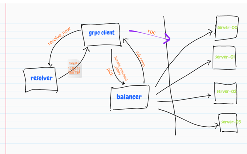
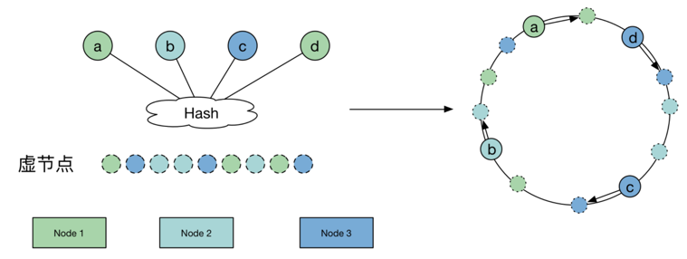

> 引用自
> https://lxkaka.wang/gprc-balancer/#balancer

# grpc 负载均衡
下面这张图展示了在 grpc 中实现负载均衡的的两个核心模块 resovler 和 balancer。




## Resolver
gprc client 通过 server name 和 grpc server 交互式，resolver 负责解析 server name, 通过 server name 从注册中心实时获取当前 server 的地址列表，同步发送给 Balancer

## Balancer
接收从 Resolver 发送的server 地址列表，建立并维护连接状态；每次当 Client 发起 RPC 调用时，按照一定算法从连接池中选择一个连接进行发起调用

核心模块原理
## Resolver 流程

代码 resolver/resolver.go重点定义如下
```go
// scheme://authority/endpoint
type Target struct {
	Scheme    string
	Authority string
	Endpoint  string
}

// 向grpc注册服务发现实现时，实际上注册的是Builder
type Builder interface {
    // 创建Resolver，当resolver发现服务列表更新，需要通过ClientConn接口通知上层
	Build(target Target, cc ClientConn, opts BuildOption) (Resolver, error)
	Scheme() string
}

type Resolver interface {
    // 当有连接被出现异常时，会触发该方法，因为这时候可能是有服务实例挂了，需要立即实现一次服务发现
	ResolveNow(ResolveNowOption)
	Close()
}

//
type ClientConn interface {
	// 服务列表和服务配置更新回调接口
	UpdateState(State)
	// 服务列表更新通知接口
	NewAddress(addresses []Address)
 	// 服务配置更新通知接口
	NewServiceConfig(serviceConfig string)
}
```

其中 Builder 接口用来创建 Resolver，我们可以提供自己的服务发现实现，然后将其注册到 grpc 中，其中通过 scheme 来标识，而 Resolver 接口则是提供服务发现功能。当 resover 发现服务列表发生变更时，会通过 ClientConn 回调接口通知上层。 那么注册进来的 resolver 在哪里用到的呢？当创建客户端的时候调用 DialContext 方法创建 ClientConn 的时候回进行如下操作
- 拦截器处理
- 各种配置项处理
- 解析 target
- 获取 resolver
- 创建 ccResolverWrapper
- 创建 clientConn 的时候回根据 target 解析出 scheme，然后根据 scheme 去找已注册对应的 resolver，如果没有找到则使用默认的 resolver。 相关代码可以在 grpc/clientconn.go 中看到。

## Balancer 流程
代码 balancer/balancer.go 重点定义如下
```go
// 声明了balancer需要用到的回调接口
type ClientConn interface {
  	// 根据地址创建网络连接
	NewSubConn([]resolver.Address, NewSubConnOptions) (SubConn, error)
    // 移除无效网络连接
	RemoveSubConn(SubConn)
    // 更新Picker，Picker用于在执行rpc调用时执行负载均衡策略，选举一条连接发送请求
	UpdateBalancerState(s connectivity.State, p Picker)
    // 立即触发服务发现
	ResolveNow(resolver.ResolveNowOption)
	Target() string
}

// 根据当前的连接列表，执行负载均衡策略选举一条连接发送rpc请求
type Picker interface {
	Pick(ctx context.Context, opts PickOptions) (conn SubConn, done func(DoneInfo), err error)
}

// Builder用于创建Balancer，注册的时候也是注册builder
type Builder interface {
	Build(cc ClientConn, opts BuildOptions) Balancer
	Name() string
}

type Balancer interface {
    // 当有连接状态变更时，回调
	HandleSubConnStateChange(sc SubConn, state connectivity.State)
    // 当resolver发现新的服务地址列表时调用（有可能地址列表并没有真的更新）
	HandleResolvedAddrs([]resolver.Address, error)
	Close()
}
```
当 Resolver 发现新的服务列表时，最终会调用 Balancer 的 HandleResolvedAddrs 方法进行通知；Balancer 通过 ClientConn 的接口创建网络连接，然后根据当前的网络连接连接构造新的 Picker，然后回调 ClientConn.UpdateBalancerState 更新 Picker。当发送 grpc 请求时，会先执行 Picker 的接口，根据具体的负载均衡策略选举一条网络连接，然后发送rpc请求。


# 一致性 Hash balancer 实现
一致性 Hash
在实现 balancer 之前，先简单介绍一下一致性 Hash 基本原理是 hash ring(hash 环)，即将节点 node 本身也 hash 到环上，通过数据和节点的 hash 相对位置来决定数据归属，因此当有新 node 加入时只有一部分的数据迁移。但事实上，这样的一致性hash导致数据分布不均匀，因为 node 在 hash ring 上的分布不均匀。分布不均匀的问题通过引入虚拟节点来解决，虚拟节点是均匀分布在环上的，数据做两次 match，最终到实际节点上。这样来保证数据分布的均匀性。


consistent-hash 我们这里用一致性 Hash 就是为了同一个用户的请求能路由到同一个 server 实例。
```go
type Ketama struct {
	sync.Mutex
	hash     HashFunc
	replicas int // 虚拟节点数
	keys     []int // 构造的 hash ring
	hashMap  map[int]string
}
```


添加节点
在添加节点时，为每个节点创建 replica 个虚拟节点，并计算虚拟节点的 hash 值存入 hash ring，也就是 keys 这个 slice 中，同时把这些虚拟节点的 hash 值与 node 的对应关系保存在 hashMap。最后给 keys 排个序，就像在环上分布，顺时针递增一样。
```go
func (h *Ketama) Add(nodes ...string) {
	h.Lock()
	defer h.Unlock()

	for _, node := range nodes {
		for i := 0; i < h.replicas; i++ {
			key := int(h.hash([]byte(Salt + strconv.Itoa(i) + node)))

			if _, ok := h.hashMap[key]; !ok {
				h.keys = append(h.keys, key)
			}
			h.hashMap[key] = node
		}
	}
	sort.Ints(h.keys)
}
```

查询节点
Get 方法是获取数据对应的节点，相当于负载均衡中源 ip 对应到哪个节点。计算数据的 hash，并在 hash Ring 上二分查找第一个大于 hash 的虚拟节点，也就通过hashMap 找到了对应的真实节点。
```go
func (h *Ketama) Get(key string) (string, bool) {
	if h.IsEmpty() {
		return "", false
	}

	hash := int(h.hash([]byte(key)))

	h.Lock()
	defer h.Unlock()

	idx := sort.Search(len(h.keys), func(i int) bool {
		return h.keys[i] >= hash
	})

	if idx == len(h.keys) {
		idx = 0
	}
	str, ok := h.hashMap[h.keys[idx]]
	return str, ok
}

```


balancer 实现
在了解了 grpc 负载均衡的工作原理之后，实现自定义 balancer 需要完成的工作：
- 实现 PickerBuilder，Build 方法返回 balancer.Picker
- 实现 balancer.Picker，Pick 方法实现负载均衡算法逻辑
- 调用 balancer.Registet 注册自定义 Balancer

实现 Build 方法
```go
func (b *consistentHashPickerBuilder) Build(buildInfo base.PickerBuildInfo) balancer.V2Picker {
	grpclog.Infof("consistentHashPicker: newPicker called with buildInfo: %v", buildInfo)
	if len(buildInfo.ReadySCs) == 0 {
		return base.NewErrPickerV2(balancer.ErrNoSubConnAvailable)
	}

    // 构造 consistentHashPicker
	picker := &consistentHashPicker{
		subConns:          make(map[string]balancer.SubConn),
		hash:              NewKetama(3, nil), // 构造一致性hash 
		consistentHashKey: b.consistentHashKey, // 用于计算hash的key
	}

	for sc, conInfo := range buildInfo.ReadySCs {
		node := conInfo.Address.Addr
		picker.hash.Add(node)
		picker.subConns[node] = sc
	}
	return picker
}

```

实现 Pick 方法
```go
func (p *consistentHashPicker) Pick(info balancer.PickInfo) (balancer.PickResult, error) {
	var ret balancer.PickResult
	key, ok := info.Ctx.Value(p.consistentHashKey).(string)
	if ok {
		targetAddr, ok := p.hash.Get(key) // 根据key的hash值挑选出对应的节点
		if ok {
			ret.SubConn = p.subConns[targetAddr]
		}
	}
	return ret, nil
}
```

一致性 Hash balancer 使用
```go
func NewClient(cfg *warden.ClientConfig) (rb.ResourceTaskClient, error) {
    // 初始化balancer
	balancer.InitConsistentHashBuilder("test")
	if cfg == nil {
		cfg = &warden.ClientConfig{}
	}
	client := warden.NewClient(cfg)
	client.UseOpt(grpc.WithBalancerName(balancer.Name))
	cc, err := client.Dial(context.Background(), fmt.Sprintf("discovery://default/%s", AppID))
	if err!=nil{
		panic(err)
	}
	return rb.NewResourceTaskClient(cc), err
}

func (s *Service) GrpcTest(ctx context.Context) (reply *rb.GetTaskResReply, err error){
    // 在context中塞入hash key
	ctx = context.WithValue(ctx, "test", strconv.Itoa(rand.Intn(1000)))
	reply, err = s.gClient.GetTaskRes(ctx, &rb.GetTaskResReq{TaskId: "ct340984037629763021"})
	return
}
```

我们把选中的节点信息打印出来展示如下, 不同的 key 选取了不同的节点，如果同一个 key 那么请求还是路由到同一个节点。由此实现我们的 session 保持的目的。

```
INFO 02/20-14:46:32.958 /Users/lxkaka/bili/cv-service/interface/balancer/conhash.go:61 hash map: map[543647748:10.217.28.143:9000 946644225:10.217.27.218:9000 2448604328:10.217.27.218:9000 2521173259:10.217.27.218:9000 3082607229:10.217.28.143:9000 3098647747:10.217.28.143:9000]
INFO 02/20-14:46:32.958 /Users/lxkaka/bili/cv-service/interface/balancer/conhash.go:62 hash key:71
INFO 02/20-14:46:32.958 /Users/lxkaka/bili/cv-service/interface/balancer/conhash.go:66 ip addr:10.217.28.143:9000

INFO 02/20-14:48:05.270 /Users/lxkaka/bili/cv-service/interface/balancer/conhash.go:61 hash map: map[543647748:10.217.28.143:9000 946644225:10.217.27.218:9000 2448604328:10.217.27.218:9000 2521173259:10.217.27.218:9000 3082607229:10.217.28.143:9000 3098647747:10.217.28.143:9000]
INFO 02/20-14:48:05.270 /Users/lxkaka/bili/cv-service/interface/balancer/conhash.go:62 hash key:705
INFO 02/20-14:48:05.270 /Users/lxkaka/bili/cv-service/interface/balancer/conhash.go:66 ip addr:10.217.27.218:9000
```


---

引用自
> https://blog.cong.moe/post/2021-03-06-grpc-go-discovery-lb/

# gRPC Go 服务发现与负载均衡

gRPC 是 Google 开源的一款高性能, 支持多种语言的 RPC 框架. 已经被广泛用于集群内服务间调用. 为了大规模流量和避免单点故障, 所以服务往往是部署多实例的, 于是负载均衡就是硬需求了.
> 注意: 本文所有内容均基于 grpc/grpc-go, 不同语言实现会有不同, 后面不在说明.

基本介绍
由于 gRPC client 和 server 建立的长连接, 因而基于连接的负载均衡没有太大意义, 所以 gRPC 负载均衡是基于每次调用. 也就是你在同一个 client 发的请求也希望它被负载均衡到所有服务端.

# 客户端负载均衡
一般来说负载均衡器是独立的, 被放置在服务消费者和提供者之间. 代理通常需要保存请求响应副本, 因此有性能消耗也会造成额外延迟. 当请求量大时, lb 可能会变成瓶颈, 并且此时 lb 单点故障会影响整个服务.

gRPC 采取的客户端负载均衡, 大概原理是:
- 服务端启动时注册地址到注册中心
- 客户端从注册中心查询目标服务地址列表, 通过某种负载均衡策略选取目标服务, 并发起请求

这种方式是客户端直接请求服务端, 所以没有额外性能开销. 这种模式客户端会和多个服务端建立连接, gRPC 的 client connection 背后其实维护了一组 subConnections, 每个 subConnection 会与一个服务端建立连接. 详情参考文档 Load Balancing in gRPC.


如何使用
根据上面分析, 我们发现使用负载均衡重点其实在于服务发现, 因为服务发现提供了 server -> addrs 的映射, 后续的 lb 仅仅是在已有 addrs 列表中根据不同策略选取不同连接发请求而已.

gRPC go client 中负责解析 server -> addrs 的模块是 google.golang.org/grpc/resolver 模块.

client 建立连接时, 会根据 URI scheme 选取 resolver 模块中全局注册的对应 resolver, 被选中的 resolver 负责根据 uri Endpoint 解析出对应的 addrs. 因此我们实现自己服务发现模块就是通过扩展全局注册自定义 scheme resolver 实现. 详情参考 gRPC Name Resolution 文档.

扩展 resolver 核心就是实现 resolver.Builder 这个 interface.
```go
// m is a map from scheme to resolver builder.
var	m = make(map[string]Builder)

type Target struct {
	Scheme    string
	Authority string
	Endpoint  string
}

// Builder creates a resolver that will be used to watch name resolution updates.
type Builder interface {
	// Build creates a new resolver for the given target.
	//
	// gRPC dial calls Build synchronously, and fails if the returned error is
	// not nil.
	Build(target Target, cc ClientConn, opts BuildOptions) (Resolver, error)
	// Scheme returns the scheme supported by this resolver.
	// Scheme is defined at https://github.com/grpc/grpc/blob/master/doc/naming.md.
	Scheme() string
}

// State contains the current Resolver state relevant to the ClientConn.
type State struct {
	// Addresses is the latest set of resolved addresses for the target.
	Addresses []Address

	// ServiceConfig contains the result from parsing the latest service
	// config.  If it is nil, it indicates no service config is present or the
	// resolver does not provide service configs.
	ServiceConfig *serviceconfig.ParseResult

	// Attributes contains arbitrary data about the resolver intended for
	// consumption by the load balancing policy.
	Attributes *attributes.Attributes
}

// Resolver watches for the updates on the specified target.
// Updates include address updates and service config updates.
type Resolver interface {
	// ResolveNow will be called by gRPC to try to resolve the target name
	// again. It's just a hint, resolver can ignore this if it's not necessary.
	//
	// It could be called multiple times concurrently.
	ResolveNow(ResolveNowOptions)
	// Close closes the resolver.
	Close()
}
```

gRPC 客户端在建立连接时, 地址解析部分大致会有以下几个步骤:
根据传入地址的 Scheme 在全局 resolver map (上面代码中的 m) 中找到与之对应的 resolver (Builder)
将地址解析为 Target 作为参数调用 resolver.Build 方法实例化出 Resolver
使用用户实现 Resolver 中调用 cc.UpdateState 传入的 State.Addrs 中的地址建立连接
例如: 注册一个 test resolver, m 值会变为 {test: testResolver}, 当连接地址为 test:///xxx 时, 会被匹配到 testResolver, 并且地址会被解析为 &Target{Scheme: "test", Authority: "", Endpoint: "xxx"}, 之后作为调用 testResolver.Build 方法的参数.

整理一下:

每个 Scheme 对应一个 Builder
相同 Scheme 每个不同 target 对应一个 Resolver, 通过 builder.Build 实例化
静态 resolver 例子
实现一个写死路由表的例子:
```go
// 定义 Scheme 名称
const exampleScheme = "example"

type exampleResolverBuilder struct {
	addrsStore map[string][]string
}

func NewExampleResolverBuilder(addrsStore map[string][]string) *exampleResolverBuilder {
	return &exampleResolverBuilder{addrsStore: addrsStore}
}

func (e *exampleResolverBuilder) Build(target resolver.Target, cc resolver.ClientConn, opts resolver.BuildOptions) (resolver.Resolver, error) {
    // 初始化 resolver, 将 addrsStore 传递进去
	r := &exampleResolver{
		target:     target,
		cc:         cc,
		addrsStore: e.addrsStore,
	}
	
    // 调用 start 初始化地址
	r.start()
	return r, nil
}
func (e *exampleResolverBuilder) Scheme() string { return exampleScheme }

type exampleResolver struct {
	target     resolver.Target
	cc         resolver.ClientConn
	addrsStore map[string][]string
}

func (r *exampleResolver) start() {
    // 在静态路由表中查询此 Endpoint 对应 addrs
	addrStrs := r.addrsStore[r.target.Endpoint]
	addrs := make([]resolver.Address, len(addrStrs))
	
	for i, s := range addrStrs {
		addrs[i] = resolver.Address{Addr: s}
	}
	
    // addrs 列表转化为 state, 调用 cc.UpdateState 更新地址
	r.cc.UpdateState(resolver.State{Addresses: addrs})
}

func (*exampleResolver) ResolveNow(o resolver.ResolveNowOptions) {}
func (*exampleResolver) Close()                                  {}
```

可以这么使用:
```go
// 注册我们的 resolver 名称解析器
resolver.Register(NewExampleResolverBuilder(map[string][]string{
  "test": []string{"localhost:8080", "localhost:8081"},
}))

// 建立对应 scheme 的连接, 并且配置负载均衡
conn, err := grpc.Dial("example:///test", grpc.WithDefaultServiceConfig(`{"loadBalancingPolicy":"round_robin"}`))
```

原理非常简单, exampleResolver 只是把从路由表中查到的 addrs 更新到底层的 connection 中.
基于 etcd 的 resolver
etcd 作为服务发现主要原理是:
1. 服务端启动时, 向 etcd 中存一个 key 为 {{serverName}}/{{addr}}, 并且设置一个较短的 Lease
2. 服务端 KeepAlive 定时续约这个 key
3. 客户端启动时 get prefix 为 {{serverName}}/ 的所有 key, 得到当前服务列表
4. 客户端 watch prefix 为 {{serverName}}/ 的 key 就能得到服务列表变动事件


## 服务端注册

```go
// 服务端注册
func Register(ctx context.Context, client *clientv3.Client, service, self string) error {
	resp, err := client.Grant(ctx, 2)
	if err != nil {
		return errors.Wrap(err, "etcd grant")
	}
	
	// 把服务端地址self 注册到etcd中
	_, err = client.Put(ctx, strings.Join([]string{service, self}, "/"), self, clientv3.WithLease(resp.ID))
	if err != nil {
		return errors.Wrap(err, "etcd put")
	}
	
	// 保持长连接
	// respCh 需要消耗, 不然会有 warning
	respCh, err := client.KeepAlive(ctx, resp.ID)
	if err != nil {
		return errors.Wrap(err, "etcd keep alive")
	}

	// 一定要有这个
	// respCh 需要消耗, 不然会有 warning
	for {
		select {
		case <-ctx.Done():
			return nil
		case <-respCh:

		}
	}
}
```
代码很简单不做过多说明.


## 客户端
```go

const (
  // etcd resolver 负责的 scheme 类型
	Scheme      = "etcd"
	defaultFreq = time.Minute * 30
)


type Builder struct {
	client *clientv3.Client
    // 全局路由表快照, 非必要
	store  map[string]map[string]struct{}
}

// 名称解析器的构建器
func NewBuilder(client *clientv3.Client) *Builder {
	return &Builder{
		client: client,
		store:  make(map[string]map[string]struct{}),
	}
}

// 构建 名称解析器
func (b *Builder) Build(target resolver.Target, cc resolver.ClientConn, opts resolver.BuildOptions) (resolver.Resolver, error) {
	b.store[target.Endpoint] = make(map[string]struct{})

    // 初始化 etcd resolver
	r := &etcdResolver{
		client: b.client,
		target: target,
		cc:     cc,
		store:  b.store[target.Endpoint],
		stopCh: make(chan struct{}, 1),
		rn:     make(chan struct{}, 1), // 容量为1，防止阻塞的
		t:      time.NewTicker(defaultFreq),
	}

    // 开启后台更新 goroutine
	go r.start(context.Background())
	
    // 进行一次全量更新服务地址
	r.ResolveNow(resolver.ResolveNowOptions{})

	return r, nil
}

func (b *Builder) Scheme() string {
	return Scheme
}

// etcd 的名称解析器
type etcdResolver struct {
	client *clientv3.Client
	target resolver.Target
	cc     resolver.ClientConn
	store  map[string]struct{}
	stopCh chan struct{}
	// rn channel is used by ResolveNow() to force an immediate resolution of the target.
	rn chan struct{}
	t  *time.Ticker
}

func (r *etcdResolver) start(ctx context.Context) {
	target := r.target.Endpoint

	w := clientv3.NewWatcher(r.client)
	rch := w.Watch(ctx, target+"/", clientv3.WithPrefix())
	for {
		select {
		case <-r.rn: // 接收到更新通知，从etcd读取地址信息，进行更新
		    // r.resolveNow()
		    // 在读取最新的数据之后 调用 r.updateTargetState() 进行更新
			r.resolveNow()
		case <-r.t.C: // 定时器触发，进行一次更新
		    // r.ResolveNow 是 发送一个消息到 r.rn 中
		    // r.rn 接收到通知之后，立刻进行更新
		    // r.resolveNow() 是重新从etcd读取数据，再进行一次更新操作
			r.ResolveNow(resolver.ResolveNowOptions{})
		case <-r.stopCh: // 关闭了
			w.Close()
			return
		case wresp := <-rch: // 监听的etcd chan 发生了变化
			for _, ev := range wresp.Events {
				switch ev.Type {
				case mvccpb.PUT:
					r.store[string(ev.Kv.Value)] = struct{}{}
				case mvccpb.DELETE:
					delete(r.store, strings.Replace(string(ev.Kv.Key), target+"/", "", 1))
				}
			}
			
			// 真正的进行连接客户端的更新的方法
			r.updateTargetState()
		}
	}
}

// 重新从etcd读取最新地址信息，再进行更新操作
func (r *etcdResolver) resolveNow() {
	target := r.target.Endpoint
	resp, err := r.client.Get(context.Background(), target+"/", clientv3.WithPrefix())
	if err != nil {
		r.cc.ReportError(errors.Wrap(err, "get init endpoints"))
		return
	}

	for _, kv := range resp.Kvs {
		r.store[string(kv.Value)] = struct{}{}
	}

	// 更新
	r.updateTargetState()
}

// 更新操作
func (r *etcdResolver) updateTargetState() {
	addrs := make([]resolver.Address, len(r.store))
	
	i := 0
	for k := range r.store {
		addrs[i] = resolver.Address{Addr: k}
		i++
	}
	
	// 更新客户端的地址信息
	r.cc.UpdateState(resolver.State{Addresses: addrs})
}

// 会并发调用, 所以这里防止同时多次全量刷新
func (r *etcdResolver) ResolveNow(o resolver.ResolveNowOptions) {
	select {
	case r.rn <- struct{}{}:
	default: // 一定要加这个 default， 防止阻塞在 r.rn 上
	}
}

// 关闭操作
func (r *etcdResolver) Close() {
	r.t.Stop() // 关闭定时器
	close(r.stopCh) // 关闭通知通道
}
```

上面代码核心在于 func (r *etcdResolver) start(ctx context.Context) 这个函数, 他做了下面三件事情:

1. watch etcd 相应的 key prefix, 变更事件发生时, 更新本地缓存, 更新底层连接的 addrs
2. r.rn channel 收到消息时做一次全量刷新, r.rn 消息在 ResolveNow 被调用时产生
3. 全局设了一个 30 分钟全量刷新的兜底方案, 周期到达时, 做一次全量刷新

使用方法和静态路由差不多, 完整代码以及事例可以查看 zcong1993/grpc-example.

## 负载均衡
说了那么多 resolver, 该说负载均衡了, 就像我们说的 lb 难点在于服务发现, 服务发现实现了之后, 使用内置的 lb 就行了, 只需要简单一个参数: grpc.WithDefaultServiceConfig(`{"loadBalancingPolicy":"round_robin"}`).

以前是可以使用 grpc.WithBalancerName("round_robin"), 但是这个方法被废弃了. 我个人认为后者更加清晰, GitHub 上面也有一个 grpc-go/issues/3003 讨论此问题, 感兴趣的可以查看.

写在最后
> 通过学习 gRPC 负载均衡我们可以看到不同类型负载均衡器的优缺点, 
gRPC 所采用的客户端负载均衡虽然解决了性能问题, 但是也为客户端代码增加了很多复杂度, 
虽然我们使用者不太感知得到, 而且文章开头也说明了 gRPC 是支持多种语言的, 
也就意味着每种语言客户端都得实现. 然而现状是不同语言的客户端对于一些新特性的实现周期有很大差异,
例如: c++, golang, java 的客户端新特性支持情况会最好, 
但是 NodeJS 之类的语言支持情况就不那么好, 这也是长期 gRPC 面临的问题. 
例如至今 NodeJS client 库还是 callback 的形式, 并且仍不支持 server interceptor.


